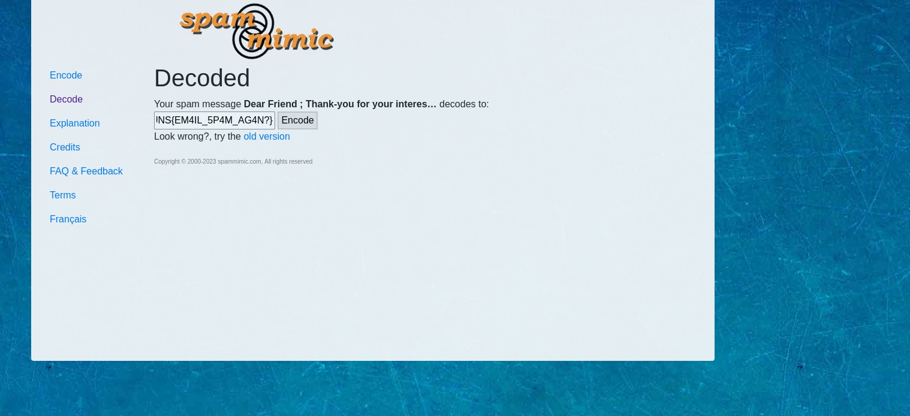
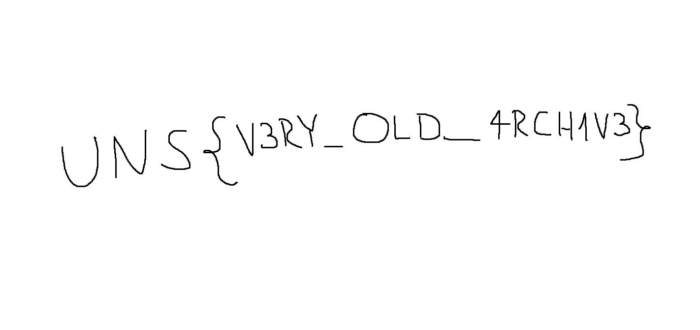

## Zadatak 4 - Nigerian prince

-   U mejlu koji je dat uz zadatak nalazi se clan zakona - Senate bill
    1622 , Title 8 ; Section 308 . Pretragom pomenutog clana nailazi se na sledeci link (prvorangirani):

-   <https://www.vbforums.com/showthread.php?157720-Decode-the-SPAM>. Na tom forum postu se pronalize sledeci link:
    <https://www.spammimic.com/decode.shtml>. Ovo je alat koji koji je u stanju da dekodira spam mejlove u skrivenu poruku.

-   Rešenje zadatka je dobijeno dekodiranjem teksta mejla na tom sajtu
    (**UNS{EM4IL_5P4M_AG4N?}**)
    

## Zadatak 5 - Educational purposes only

- Potrebno je odgovoriti na cetiri pitanja i spojiti ih da bi se dobila sifra
    - 1) Date when Faculty of Technical Sciences officialy opened. (Date Format : DD/MM/YYYY)
        Odgovor je nadjen na: <https://en.wikipedia.org/wiki/University_of_Novi_Sad_Faculty_of_Technical_Sciences> i jeste: 28/06/1960
    - 2) First name of the person who held the position of dean at the faculty from 01.10.1975. until September 30, 1977. ?
        Odgovor je nadjen na <http://www.ftn.uns.ac.rs/n508315396/istorijat-funkcije-dekan> i jeste: Dragutin
    - 3) The date when the FTN website was launched. (Date Format : DD/MM/YYYY)
        Odgovor je nadjen na <http://www.ftn.uns.ac.rs/102746447/novi-sajt> i jeste: 18/05/2005
    - 4) The year when studies in the field of "Poštanski saobraćaj i telekomunikacije" were introduced.
        Odgovor je nadjen na <http://www.ftn.uns.ac.rs/n1243898707/faculty-of-technical-sciences> i jeste: 1999
- Spojenu sifru uneti pri otvaranju zapakovanog fajla pri cemu dobijamo flag.png sliku koju mozete videti ispod.
        